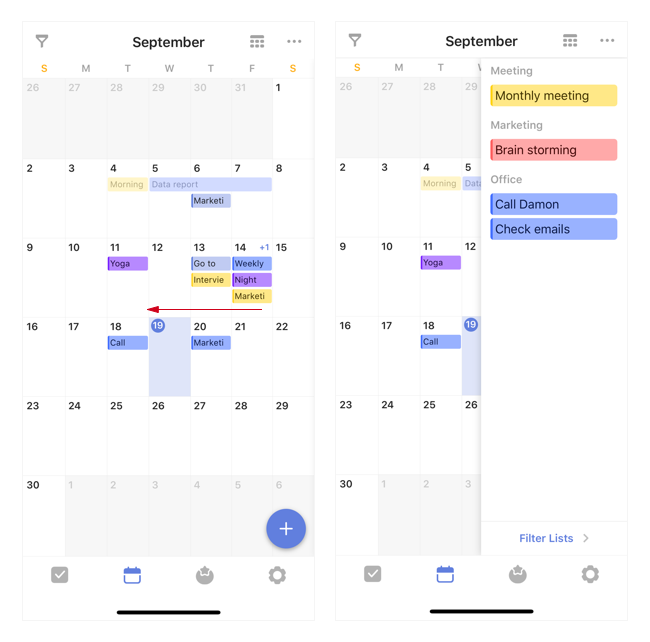
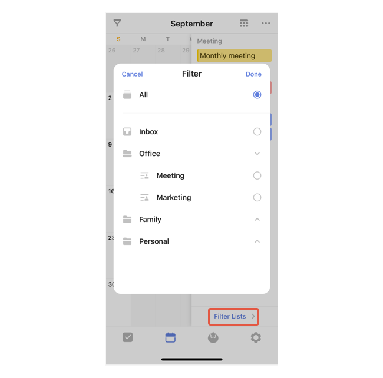
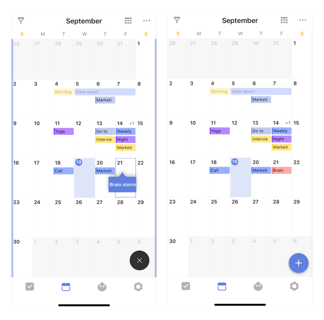
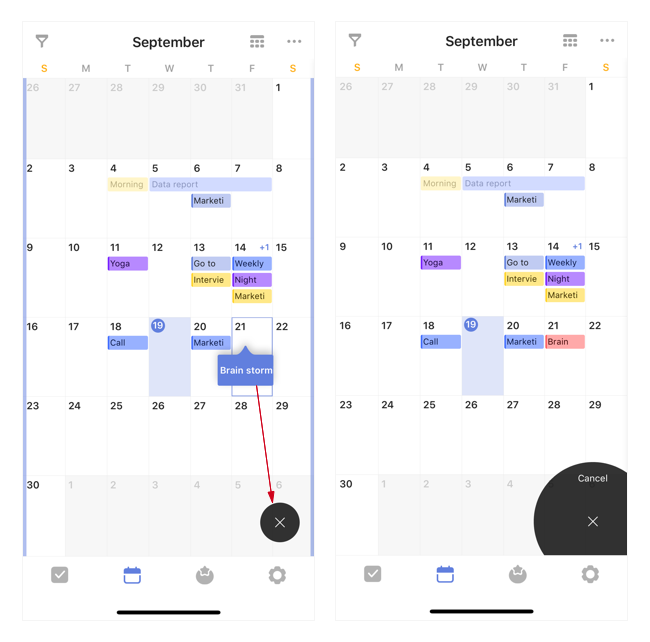

### Arrange undated tasks in the calendar view

In the calendar view, swipe to the left to unfold the "Arrange Tasks" area. Tasks that haven’t been given any due dates will be displayed here.

If you want to arrange certain tasks only, for example: work-related tasks. You can tap the "Filter Lists" button on the bottom and make your selections.

Once you‘re ready to start arranging, long press on a task and drag it onto the calendar, release to set up a date.

If you want to cancel the current action, drag & drop the task onto the "x" area on the bottom right corner.

When you are done, simply swipe to the right to fold the "arrange tasks" area.

