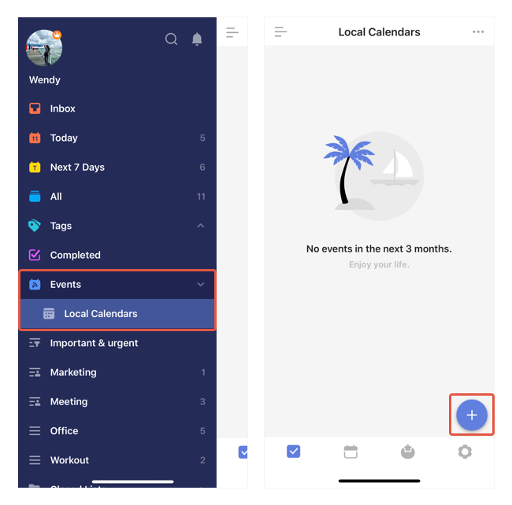

### How to add calendar events in TickTick ?

If you have already enabled your local calendar in TickTick, you can add events directly.

1. Go to the left sidebar and enter Local Calendar.

2. Tap the "+" button at the bottom right corner and start creating new events.

