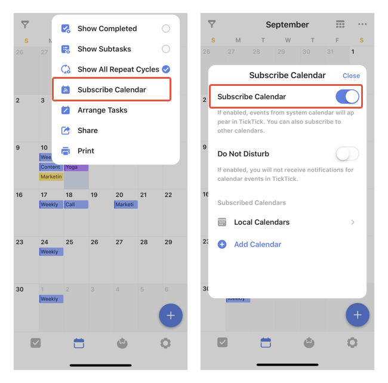
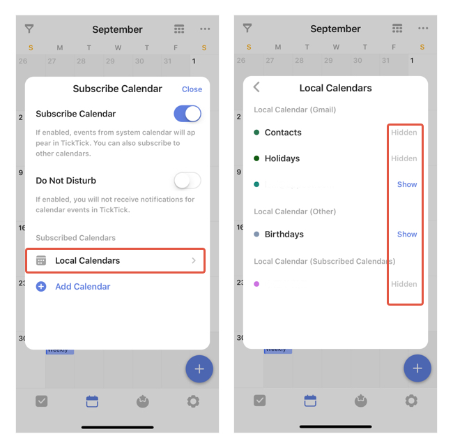

### How to display local calendar events in TickTick?

To display events from your local calendar in TickTick, you must first enable "Subscribe Calendar".

Then you can select what events in your local calendar that you'd like to see in TickTick. Tap to switch between "Show", "Hidden", "Show in Calendar".

