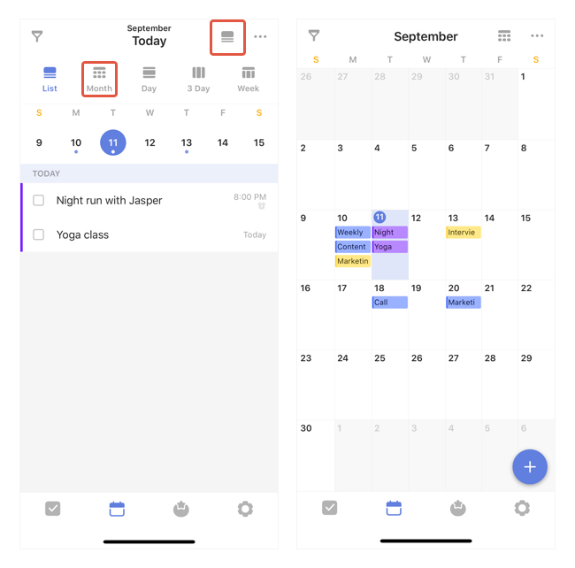
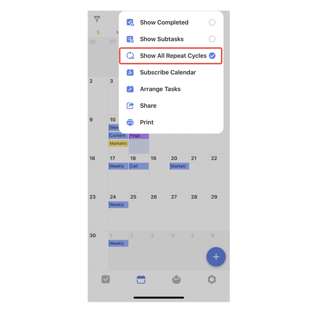

### How to get to the monthly view?

To switch to the monthly view of calendar, tap the option button in the upper right hand corner of list view and choose "Month".

#### How to show/hide future cycles for repeating tasks?

Tap the option menu in the upper right hand corner and choose/not choose "Show All Repeat Cycles".

