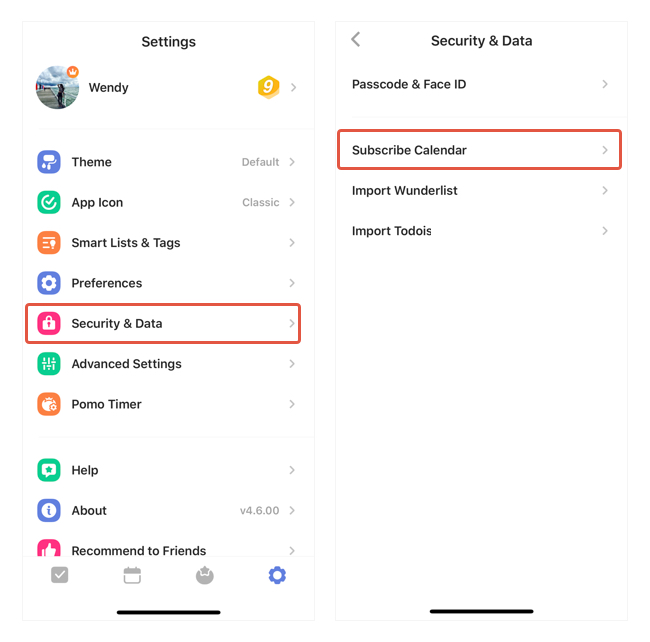
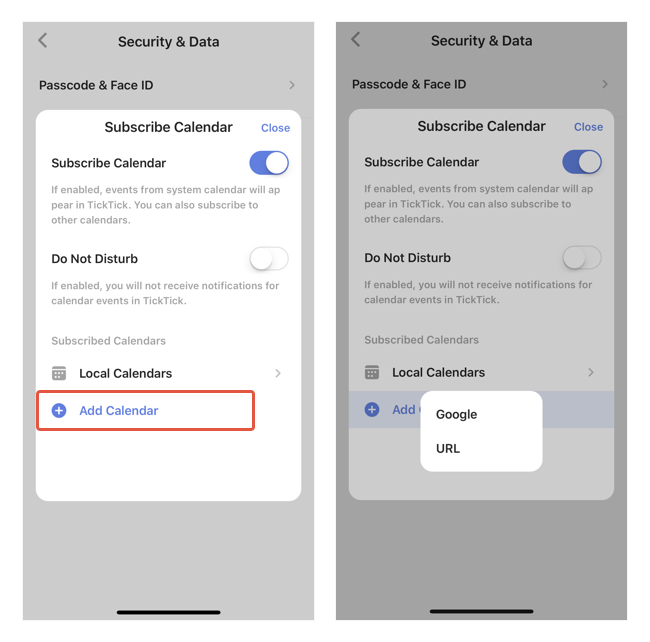

### How to subscribe other calendar service? 
To subscribe to third-party calendars in TickTick:

1. Go to Settings from the tab bar, then enter "Security & Data" - "Subscribe Calendar".

2. Enable "Subscribe Calendar" - tap "Add Calendar" and choose between Google Calendar or subscribe via URL.

