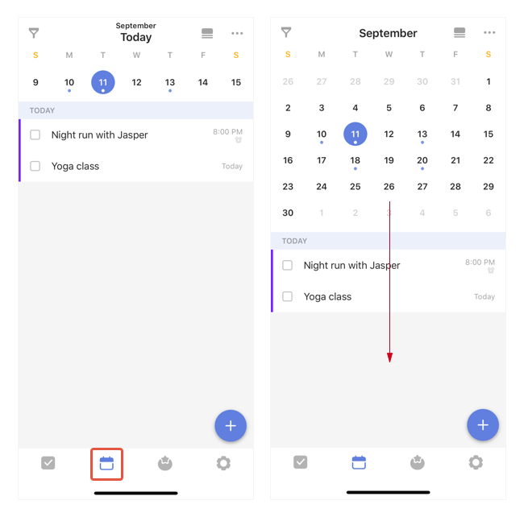

### What is Calendar View?

Calendar View allows you view your tasks with due date in a calendar. You can enter Calendar from the tab bar.

Note: 

-Slide down to show the full calendar.
-USe drag & drop to change a task's due date.

