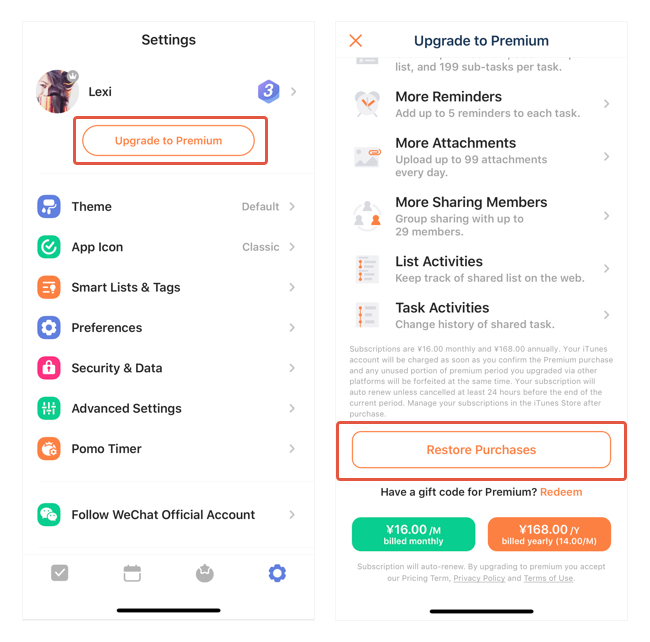

### Can't use premium features after purchasing?

1. Go to Settings form the tab bar.

2. Tap "Upgrade to Premium".

4. Tap "Restore Purchases" at the bottom of the page.

**If the problem isn't solved, please contact us via email: support@ticktick.com**

