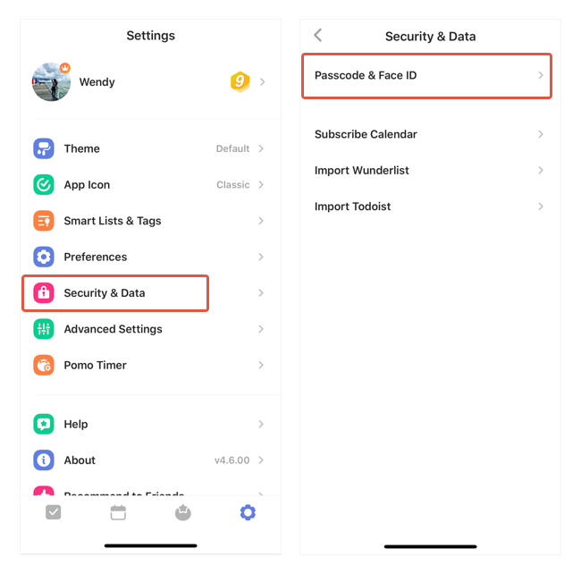

### How to lock the app?

There are two ways to lock TickTick: Passcode and Touch ID.

**- Passcode**

1. Go to Settings from the tab bar.

2. Tap "Security & Data".

3. Tap "Passcode & Touch ID".

**- Face ID**

"Face ID" can be enabled in the same page as above.

