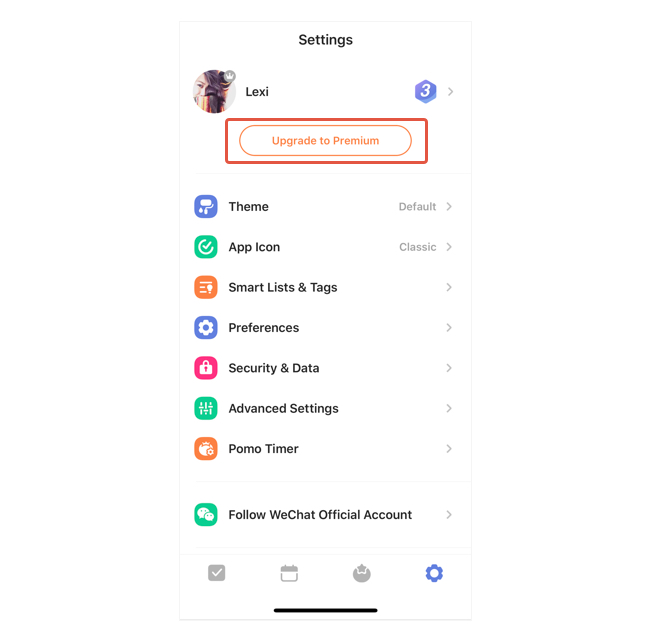

### How to upgrade to/renew a premium account?

1. Go to Settings from the tab bar.

2. Tap "Upgrade to Premium".

3. Select between monthly/annual plan and follow the instructions to complete your purchase.

