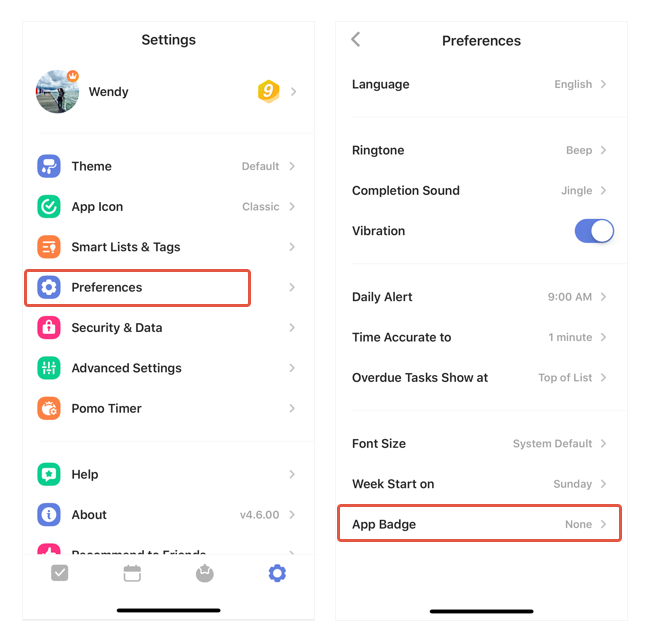

### What does the app badge count for?

The small red badge that hovers over the TickTick app icon counts the number of "Today & Overdue" tasks by default. You can choose the task types to be counted in the App Badge.

1. Go to Settings from the tab bar.

2. Tap "Preferences".

3. Tap "App Badge" to choose the task type(s) you wish to include in the App Badge count.

