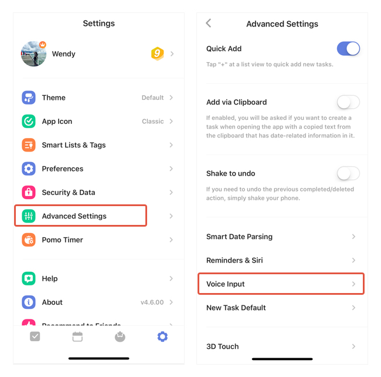

### Why voice input can't recognize my language?

If this issue happened, please check in the Advanced Settings to see which voice typing language TickTick is currently using.

1. Go to Settings from the tab bar.

2. Tap "Advanced Settings".

3. Tap "Voice Input", then select the correct language.

