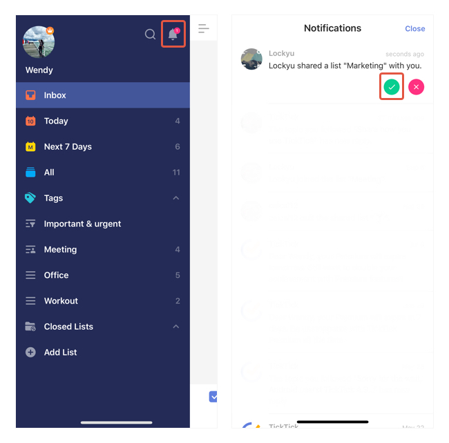

### How to accept a shared list?

If someone shares a list with you, you will receive an invitation to ask you to accept the list.

1. Go to the left sidebar and check in the notification center.

2. Select to accept or decline the invitation.

After accepting a shared list, it will automatically become as a list of yours and appear on the left sidebar with your other lists.

