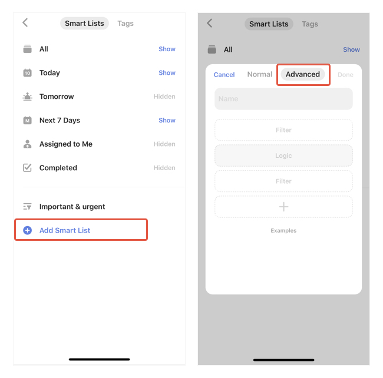

### How to create a Custom Smart List?

1. Go to Settings from the tab bar.

2. Tap "Smart List".

3. Tap "Add Smart List" at the bottom of the screen, then tap "Advanced" to add a custom Smart List.

You can sort items by List, Tag, Date, Priority, Assignee. These Filters shall be flexible enough to help you create your own Smart List.

If you want to focus on high-priority & urgent tasks only, try choosing "High priority", "Today", and "Tomorrow" as the filters and create a custom smart list. 

