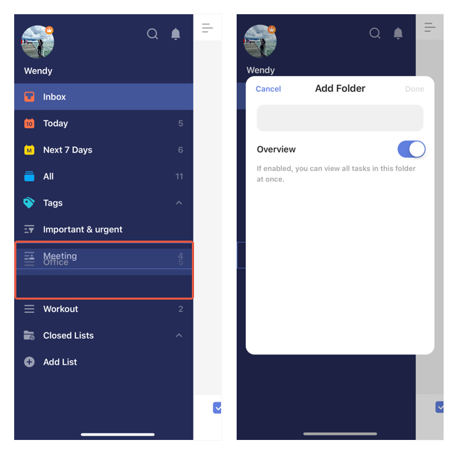

# How to create folders?

1. On the left sidebar, drag a list onto another list and release to create a folder that includes the two lists. 

3. Name the folder and select whether you want an "All tasks" list under this folder.

4. After a folder's created, drag other lists onto it to put them under this folder too.

