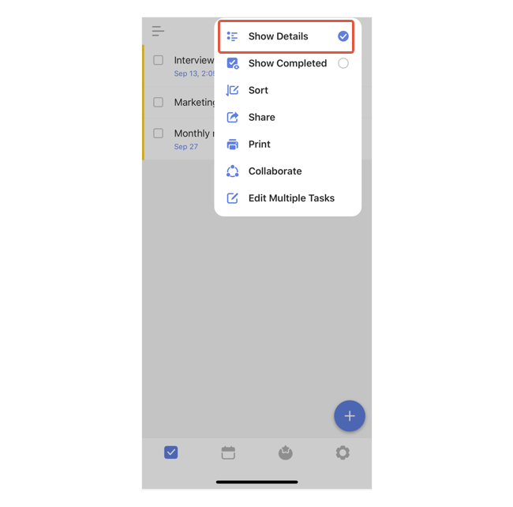

### How to show/hide details?

You can choose to show/hide details in any list view.

1. Click into a list.

2. Tap "..." icon at the top right hand.

3. Select to show/hide details.

By allowing to show details, the following information of each task will be shown :

* >Due date, if the task has
Tags, if the task has any
A alert icon, if the task has a reminder
A repeat icon, if it's a recurring task
An attachment icon, if the task has attachment(s)
Its parent list
Progress Pie chart, which indicates the progress of subtasks in this task (auto hidden if none of the subtasks has been done yet)
The FIRST subtask

