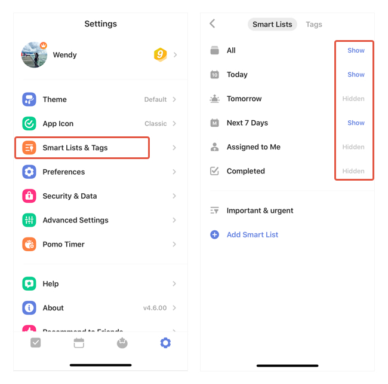

### How to show/hide Smart Lists ?

To show/hide certain smart lists from the left sidebar:

1. Go to Settings from the tab bar.

2. Select "Smart Lists & Tags".

3. Choose between "show"/"Hidden"/"Auto".

