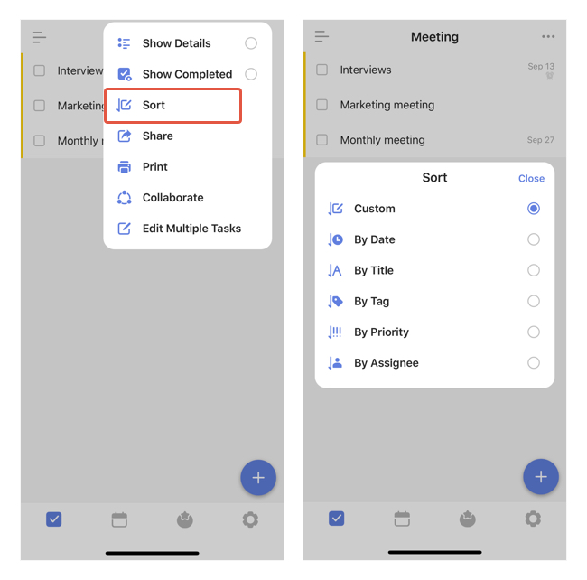

### How to sort tasks under a list?

In any list view, you can drag and drop to manually change tasks order. Also, you may use the auto sort feature to sort them faster.

How: In a list view, tap the "..." icon at the top right corner - Sort. You can choose a sort rule from **Date, Title, Tag, Priority, Assignee**. 

Note: Use two sort rules at the same time is not supported.

