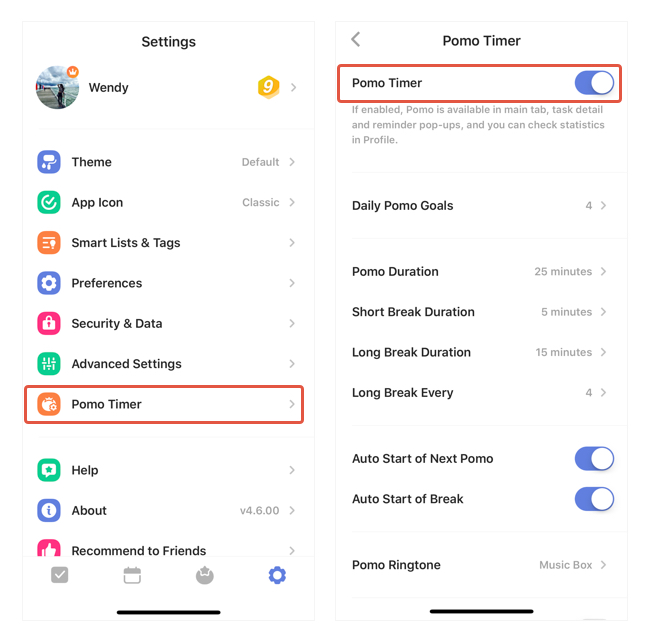

### How to add pomo timer to the tab bar?

1. Go to Settings from the tab bar. Then enter Pomo Timer.

2. Enable it in there.

You may also hide this function from the tab bar by following the instruction above.

