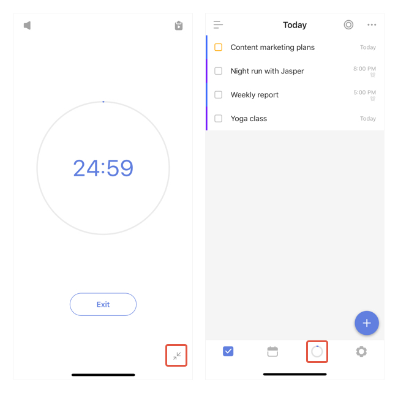

#### How to minimize the pomo timer?

Once a pomo's started, a "Minimize" botton will appear at the bottom right corner. Tap to minimize the pomo timer. 

With the minimized pomo timer, you can then add more tasks or do other actions in TickTick. Your pomo will still be functioning and calculating in the background.

You can check the pomo status from the color circle that's running around the pomo timer tab button. The circle will automically change color at break time and a notification banner will appear to remind you as well.

