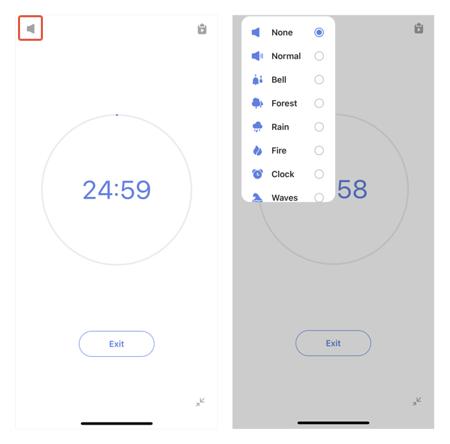

#### How to play a white noise during a pomo?

After the pomo timer's started, a "white noise" button will appear at the top left corner. Tap on it and select a white noise to play at the background.

Note: White noise can only play one in a time. You cannot select to play multiple white noises together.

