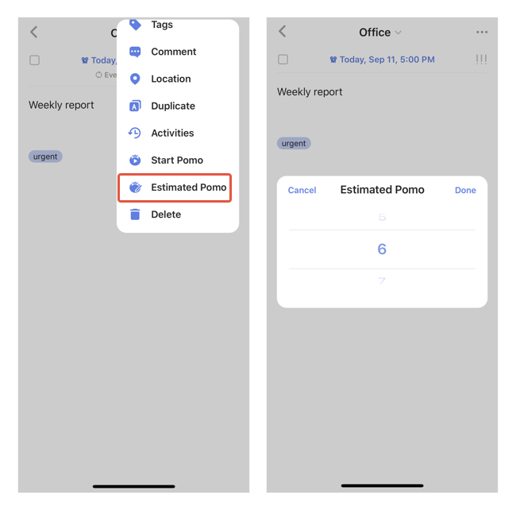
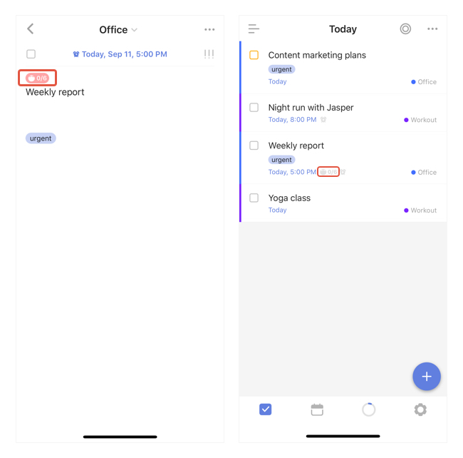

#### How to set up estimated pomo?

1. In a task detail view, tap the "..." icon at the top right corner and select "Estimated Pomo".
3. Choose from 0 to 30 to set up a number of estimated pomo for this task.

Once the estimated pomo's been set to a task, you can check it from either in the task detail view or in the list view with "Show Details" mode on.

