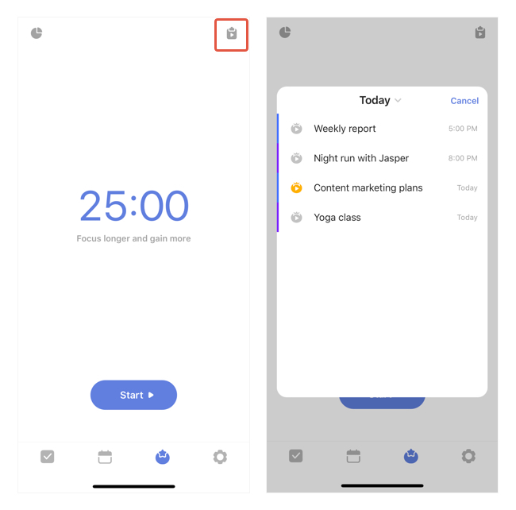
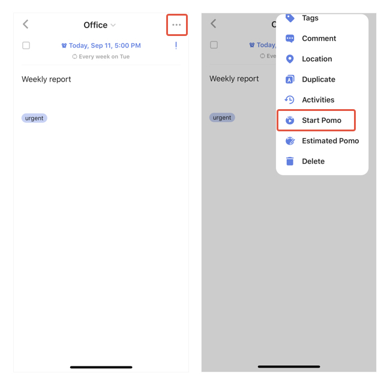
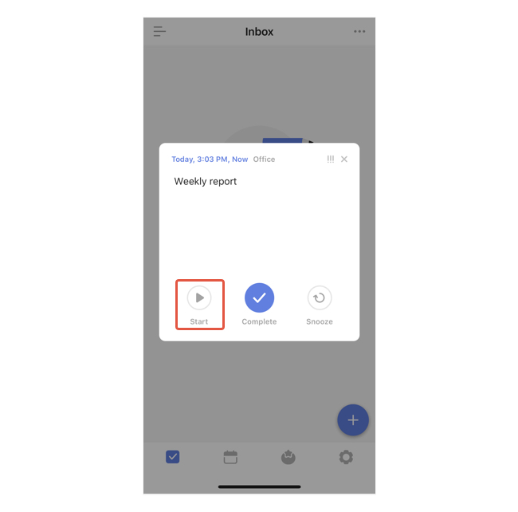
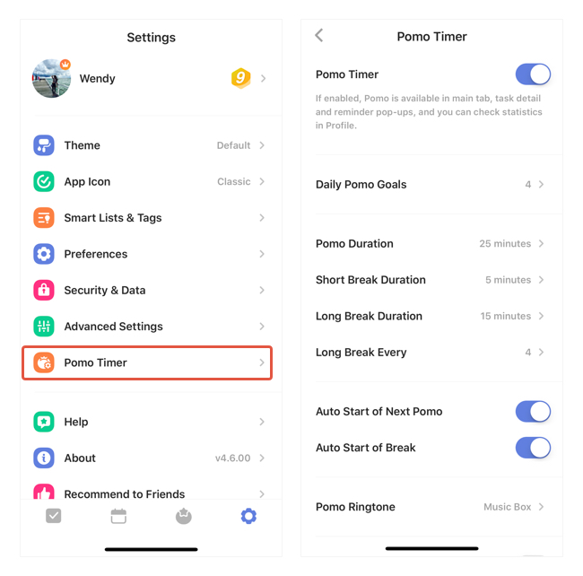

#### Three ways to start a pomo

##### In the pomo timer:

1. Go to the pomo timer from the tab bar.
2. Tab the button at the top right corner and select a task that you want to focus on.
3. Pomo timer will be auto started once you select a task.

##### In a task detail view:

Tap the "..."icon at the top right corner - Select to "Start  Pomo".

##### Via a task notification:

When a notificaiton pops up in TickTick,  tap the "Start" button and begin to focus rightaway.

 

#### How to custom my Pomo settings?

1. Go to "Pomo Timer" from the Settings page.
2. Customize the settings such as Short break Duration, Long Break Duration,etc.

#### Can I skip to break or pause a pomo?

No. Except for abandoning the current pomo, the function is not designed to be interrupted by other actions. The pomo timer function was developed based on The Pomodoro Technique - one of the most useful time management methods in the world. For more info: [https://cirillocompany.de/pages/pomodoro-technique](https://cirillocompany.de/pages/pomodoro-technique)

