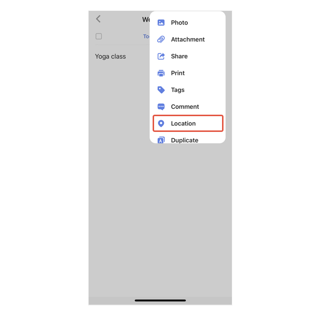

### How to set a location reminder?

In order for Location reminder to work, Location Services needs to be enabled in the system settings.

1. Enter a task detail view, tap the "..." button at the top right corner.

2. Select "Location". You can choose to be reminded of the location either when you arrive the destination or when you leave the location.

