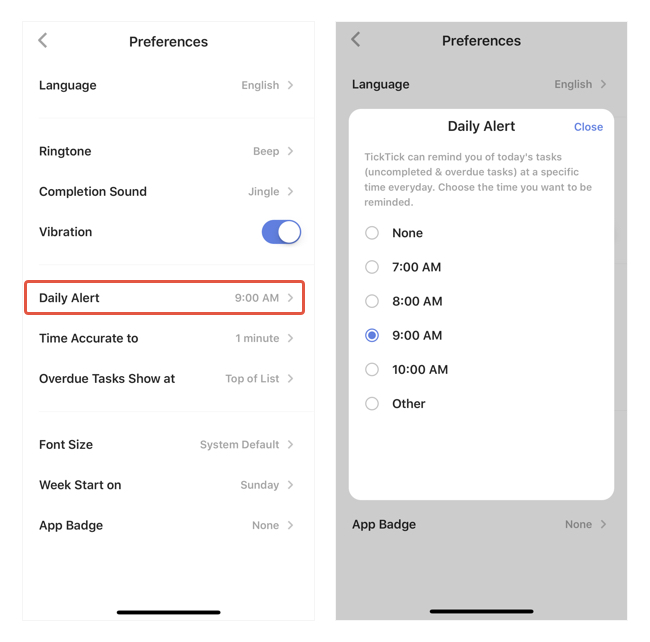

### How to set "Daily Alert"?

Daily Alert is a daily summary of all of your "Overdue" and "Today" tasks. You can set the Daily Alert to go off at a specific time every day.

1. Go to Settings from the tab bar, then enter "Preferences". 

2. Select "Daily Alert", then set a time of daily alert.

