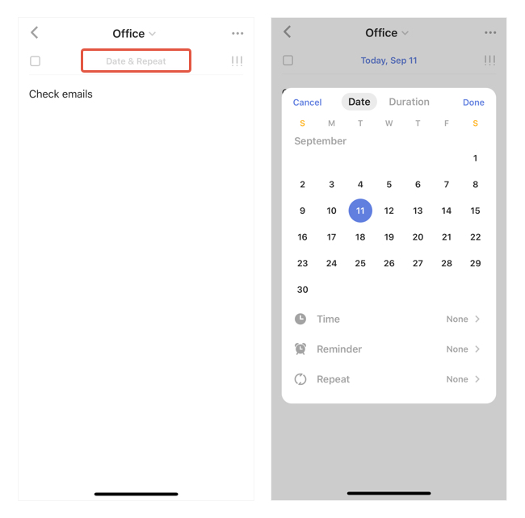

### How to set due date and reminders for a task?

You can add a reminder to any task in TickTick. Here's how:

1. In a task detail view, tap the "Date & Repeat" button at the top.

2. Tap to enter the setting page for Time or Reminder

Note: Free users can add 2 reminders per task. Premium users can have up to 5 reminders per task.

