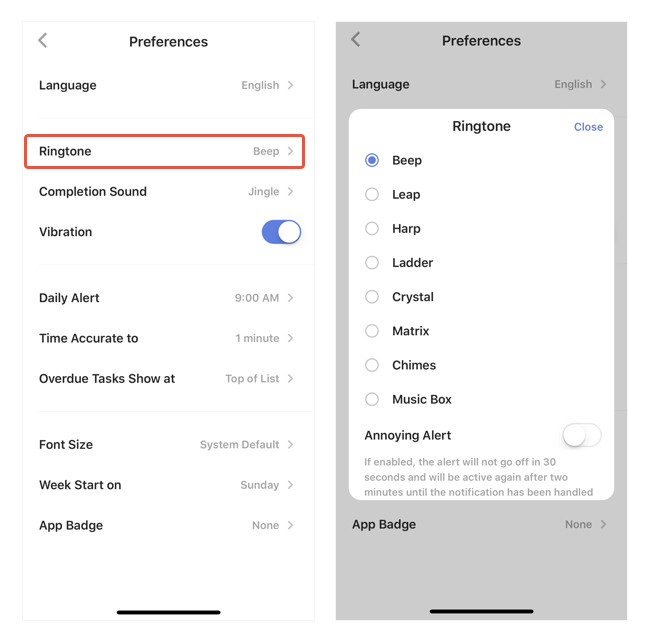
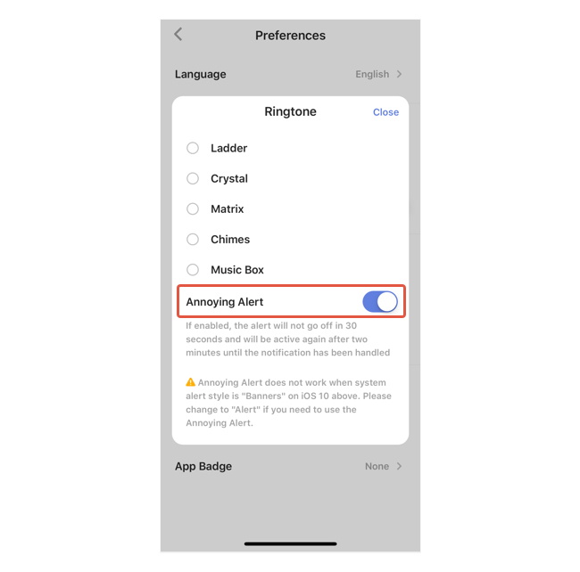

### How to set reminder ringtone and annoying alert?

#### Set ringtone for reminders

1. Go to Settings from the tab bar, then enter "Preferences". 

3. Select "Ringtone", then choose from one of the ringtones. 

#### Annoying alert

If "annoying alert" is enabled, the alert will not go off in 30 seconds and will be active again after two minutes until the notification has been handled.

