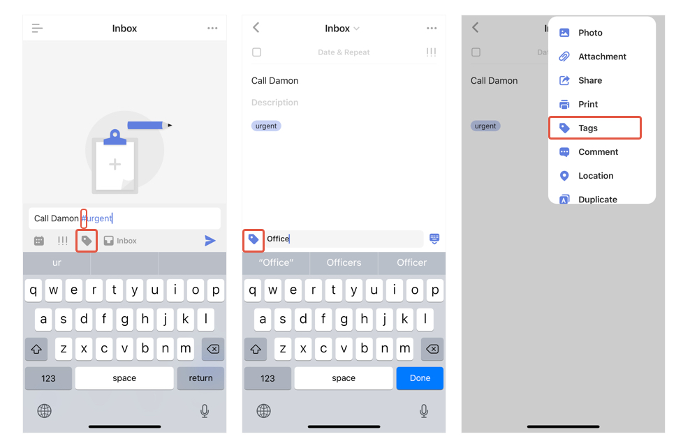

### 4 ways to add tags for tasks

1. Insert # with a tag when creating a new task.

2. Tap the "tag" button on the quick add bar when creating a new task.

3. In a task’s detail view, tap the "Tag" icon that locates at the lower left corner and start typing, tap space or enter to save when finished.

3. In a task’s detail view, tap the "..."  button at the top right corner, select "Tags".

#### Batch add tag to multiple tasks

Tap the "..." button at the top right corner in a list view - Select "Edit Multiple Tasks"- Choose multiple tasks - Tap "..." on the bottom right corner - Select "Tags".

