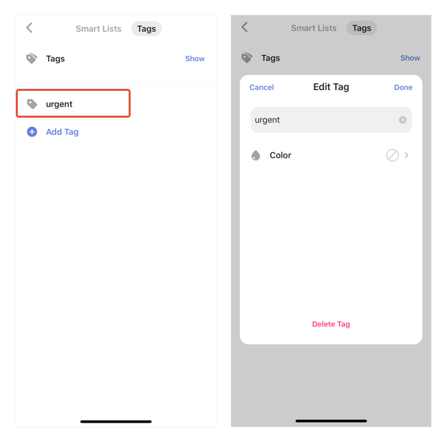

### How to edit / delete existing tags

Once you have a commonly used tag that’s associated with many tasks, edit the tag name or delete the tag and auto remove it from all tasks would be very useful. In TickTick, you can batch edit tags without going into each task.

How: Find Tags on the left sidebar - Left swipe on the tag that you want to edit - Tap the "Edit" button. You can also delete a tag and auto remove this tag from all related tasks by tapping the "delete" button next to the "Edit" button.

Antoher way is to do it at where you add these tags via Settings - Smart Lists & Tags - Tags, and manage your existing tags there.

