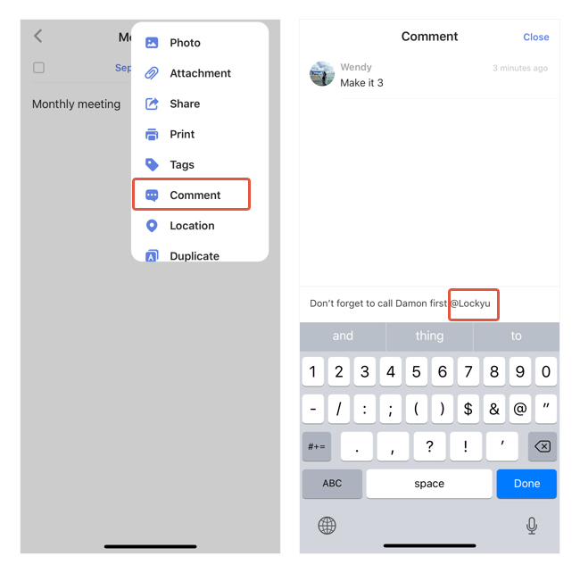

### How to add comment to a task?

1. Tap the "..." button at the top right corner in a task detail view.

2.  Select "Comment".

If it is a shared task, all members can view and leave comments to this task.

 

Note: Use @ to mention someone in a shared list, he/she will then receive a notification in TickTick.

