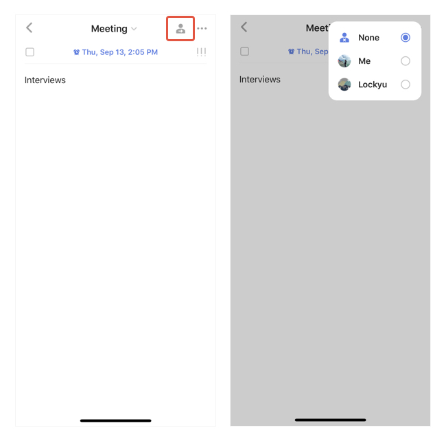

### How to assign a task?

Please note that only tasks in a shared list can be assigned.

1. Select a shared list, then choose a task in this list.

2. Tap the "Assign" button at the top right corner.

3. Choose a member that you want to assign to.

 
Note: One task can be assigned to one member only.

