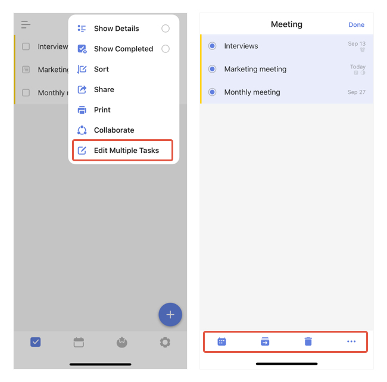

### How to batch edit tasks?

1. In a list view, tap the "..." button at the top right corner. 

2. Select "Edit Multiple Tasks".

3. Make your selection and tap the bottom bar to: Change due date, Move list, Delete task, More.

