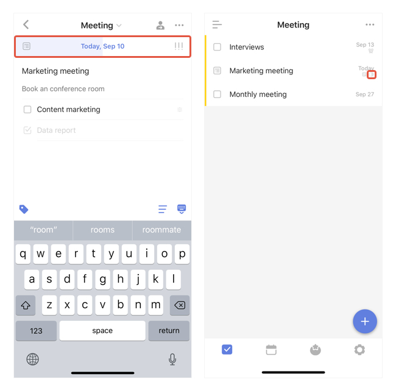

### How to check task progress?

-Enter a task detail view and check from the top indicator. You may hold&drag to change the progress as well.

-In the list view, a small indicator will appear when at least one subtask's completed.

