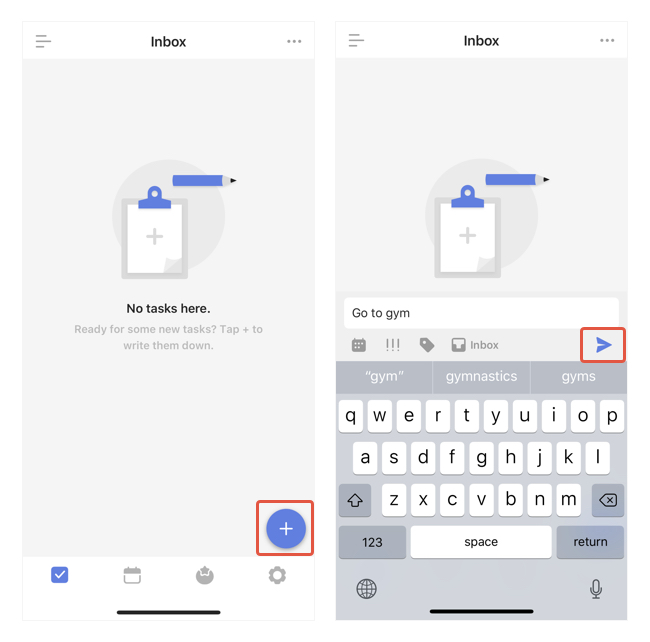
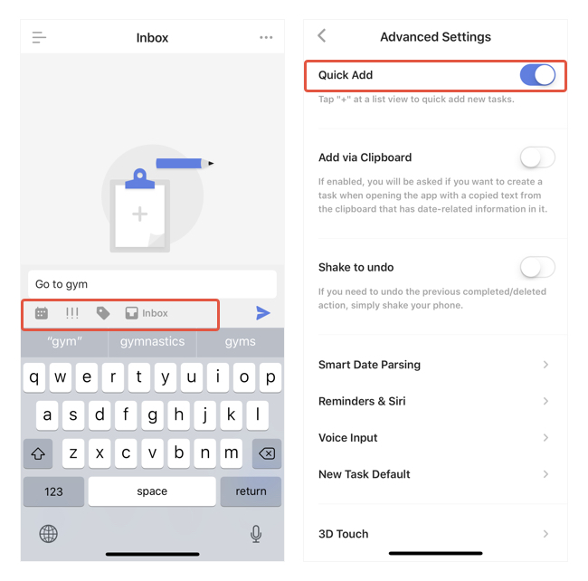
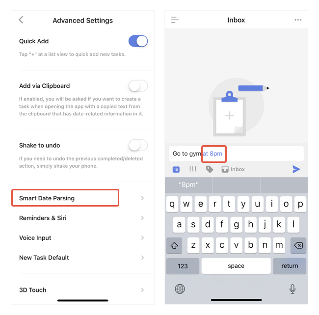
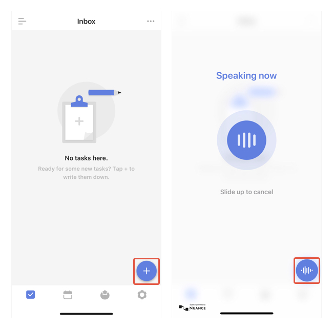
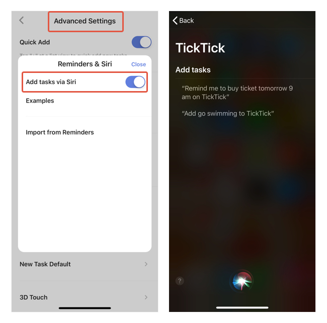

### How to create a new task?

TickTick offers many ways to create new tasks:

####Add Button

1. In the main task tab view.

2. Tap the "+" button at the bottom right corner and start typing.

#### Quick Add Bar

1. Go to Settings from the tab bar, then go to "Advanced Settings".

2. Enable "Quick add". 

####Smart Date Parsing when adding new tasks

If you type the date/time info in the task name, TickTick will automatically recognize the date as the due date and set the time as the reminder time for the task.

For example, if you type: "Go to library next Saturday 2 pm". TickTick will automatically create a task that's due next Saturday and remind you at 2pm on that day.

##### Remove date & time info from task content when using Smart Date Parsing

If you don't want the date/time info remains in the task name after parsing, you can set TickTick to remove it for you. Go to Settings - Advanced Settings - Smart Date Parsing - Remove Text in Tasks.

#### Voice Input

1. In the main task tab view.

2. Press & hold the "+" Button at the bottom right corner and start speaking. Release when you finish. 

Note: If TickTick can't recognize your language, check the language for "Voice Input".

####Siri Integration

1. Go to Settings from the tab bar, then go to "Advanced Settings".

3. Select "Reminders & Siri".

4. Enable "Siri Integration".

After enabled, tasks you created in Apple's Reminders app and tasks you created with Siri will be added to TickTick's Inbox. The original tasks will be removed from Apple's Reminders app.

