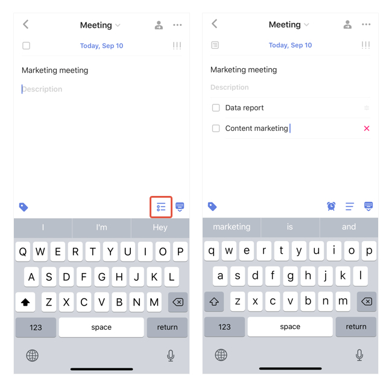
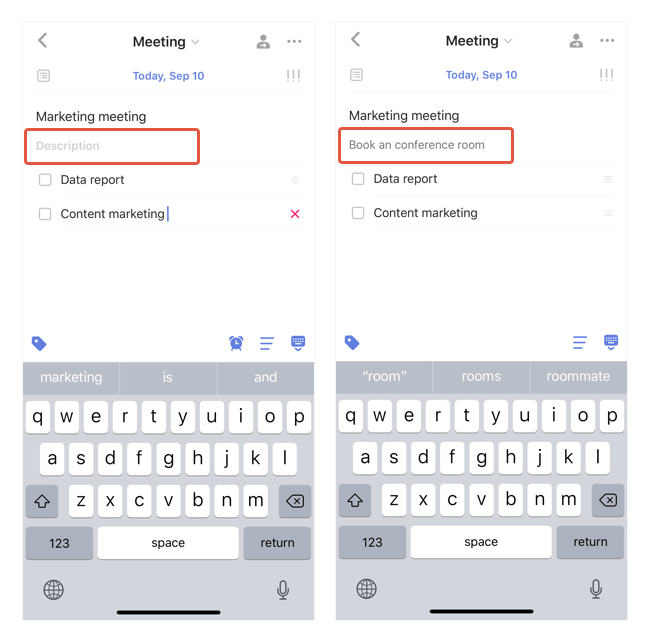

### How to create a subtask?

1. Select a task and enter its detail view.

2. Tap the "Subtask" button on the top right corner of the keyboard to switch to subtask mode. 

3. Start adding subtasks, press Return to start with a new subtask.

Note: Inbetween the task name and subtasks is an area where you can add a task description. 

