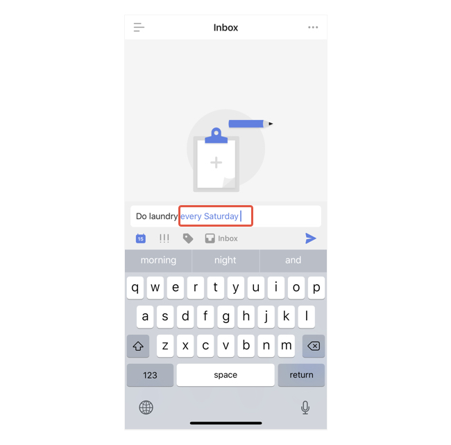
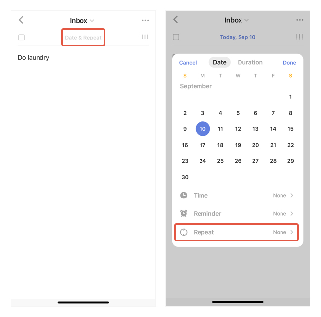
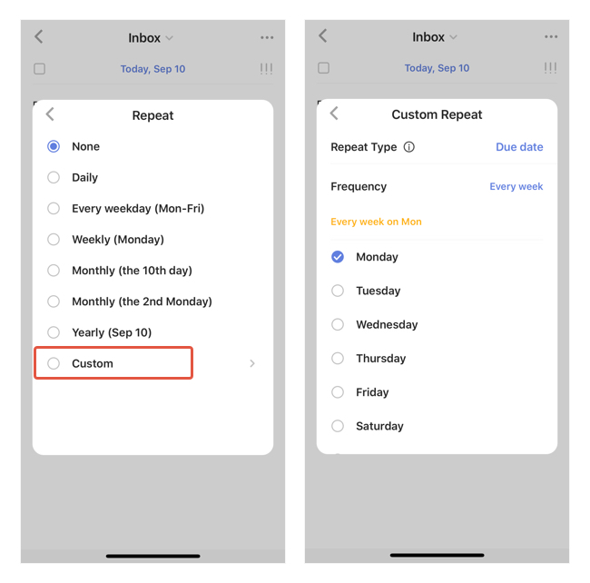

### How to create a recurring task?

-Include the recurring info when typing the task name. See the example pic below:

-In a task detail view, tap the Date & Repeat button at the top. Then select Repeat.

-If you want more flexible repeat rules than the regular ones, select "Custom" in "Repeat".

