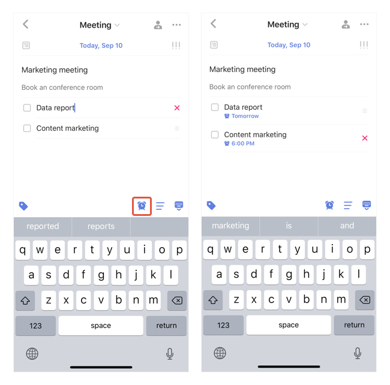

### How to create reminder for subtask?

To create separate reminders for each subtask is a premium feature.

1. Enter a task detail view and select a subtask.
2. Tap the "alarm" icon and create a reminder for it.
4. Select another subtask and create another reminder.

