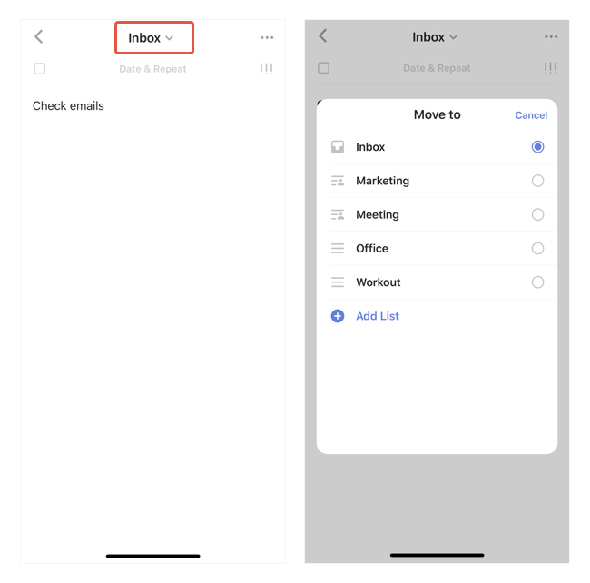
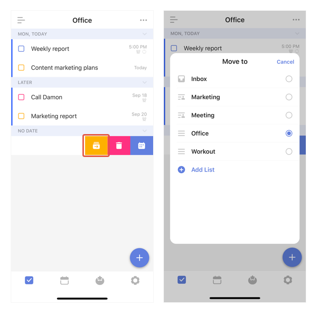

### How to move a task from one list to another?

##### Option 1:

1. In a task detail view, tap the top area that shows the task's current list.

2. Select a new list for this task.

##### Option 2:

1. In a list view, swipe a task to the left, then tap the first "Move to" icon.

2. Select a new list for this task.

