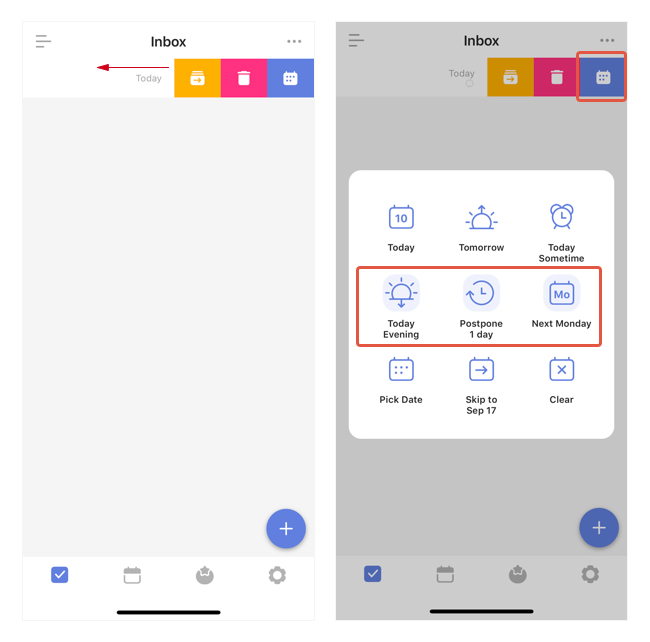

### How to swipe tasks for quick actions?

Short swipe a task to the left, and then three option buttons will appear:

1. Move a task from one list to another.

2. Delete the task .

3. Quick date menu. (Note: Long press on the second row of the quick date menu to customize)

Note: if you long swipe a task to the left until the taskbar becomes blue, you will automatically enter the quick date menu.

