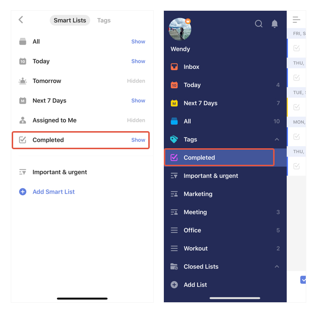

### Where can I check all of my completed tasks?

The "Completed" list contains all of your completed tasks. But it's hidden by default.

If needed, go to Settings - Smart Lists & Tags - select "Show" for "Completed". You will then be able to see the list appear on the left sidebar.

