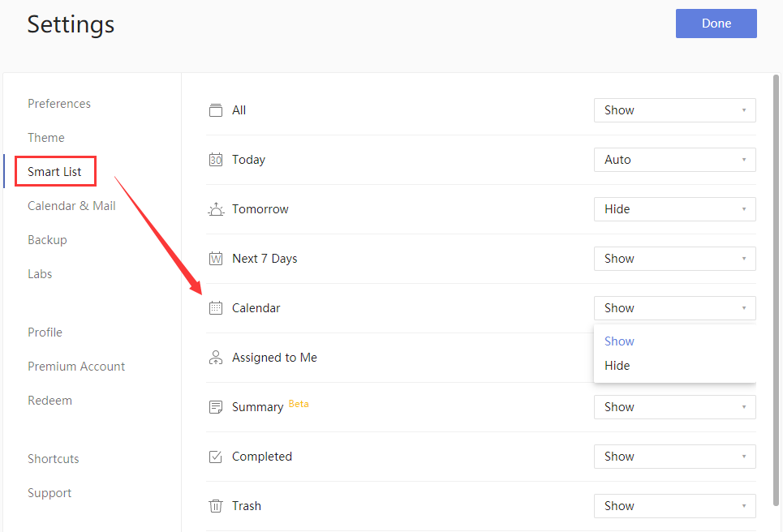
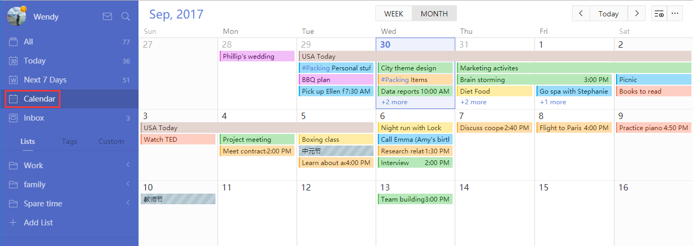

### What is "Calendar View"? (Premium)

The Calendar View presents your tasks in a traditional calendar view instead of in a vertical list of task items.

**How to enable "Calendar View"?**

1. Sign in to TickTick on the web.

2. Click the avatar in the upper-left corner of your TickTick homepage, then click "Settings" from the menu that appears.

3. Click "Smart List" in the left panel, and choose "Show" Calendar in the right panel.

4. The "Calendar" list will be displayed below "Next 7 Days". 

You can drag and drop a task from one date to another date. You can click a task to edit it or click a date to add a new task. 

