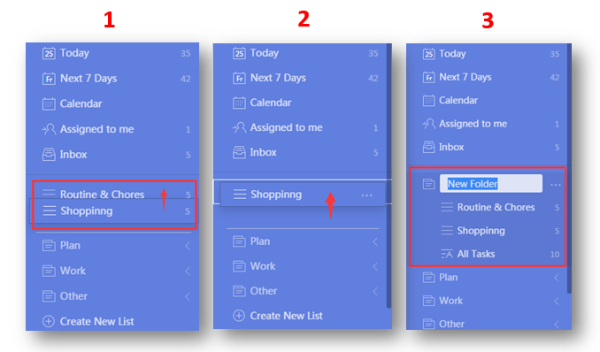

### How to create a list folder?

With Folders, organizing your lists is as simple as drag-and-drop.

1. Sign in to TickTick on the web.

2. Drag a list on top of another one that you would like to include in the same folder.

3. Hover your list over the list you want to be stored in the same folder, until a blue box appears around that list.

4. Drop the chosen list by releasing the mouse button, and then name the folder.

