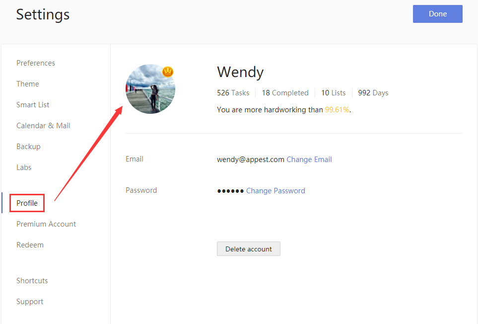

### How to upload profile image?

1. Sign in to TickTick on the web.

2. Click the avatar in the upper-left corner of your TickTick homepage, then click "Settings" from the menu that appears.

3. Click "Profile" in the left panel.

4. Click the avatar to upload a profile image.

