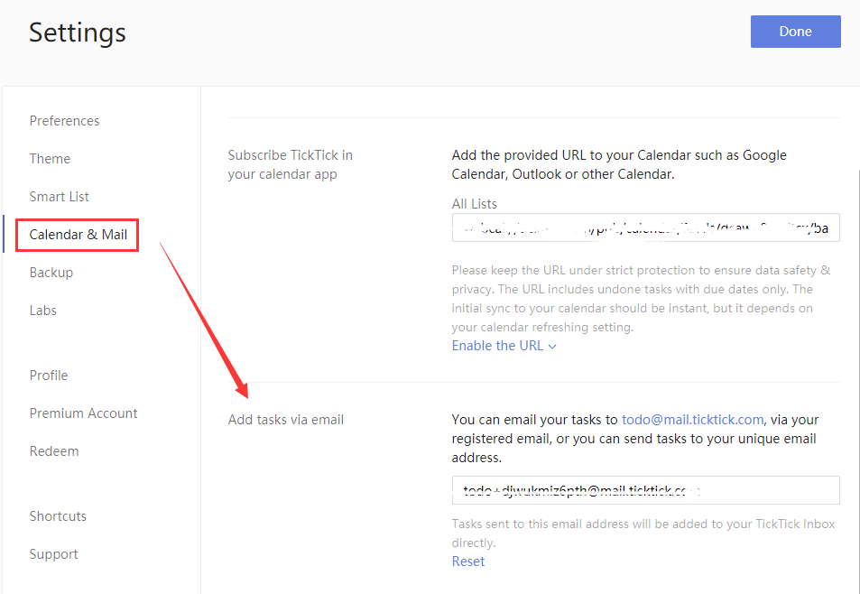

### How to add a new task via email?

If your email inbox is full of to-dos, you can turn them into tasks using Mail Service in TickTick.

1. Sign in to TickTick on the web.

2. Click the avatar in the upper-left corner of your TickTick homepage, then click "Settings" from the menu that appears.

3. Click "Calendar & Mail" in the left panel.

Two separate email address appear at the bottom of the right panel.

#### 1. todo@mail.ticktick.com.

If you sign into TickTick with a registered email address, you can email your task to todo@mail.ticktick.com via your registered email address.

#### 2.todo+####@mail.ticktick.com.

This is a unique email address generated for your TickTick account (Note: click "Reset" to obtain a new address). You can email your task to TickTick by using any email program to send your task to todo####@mail.ticktick.com.

The email subject line becomes the task name, while the items in the body of your email become the details appearing in the task . You can also add a date and reminder time to the email subject to cause TickTick to set a due date for your task on that date with that reminder. For example, you can write "Go to Starbucks with Frank tomorrow 4pm" or "Go shopping 2/4 4pm" in the subject, then you will find this task in TickTick's "Inbox" with the same due dates and reminder times.

