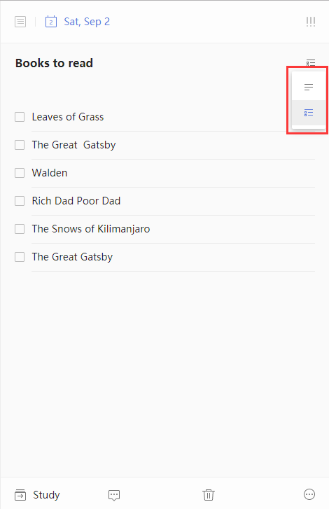

### How to create a checklist?

Checklist functionality is frequently used to break a big task into some small ones such as arranging a family trip. Simply click on the button with three horizontal lines in the upper-right corner of the right panel and choose checklist view.

  

