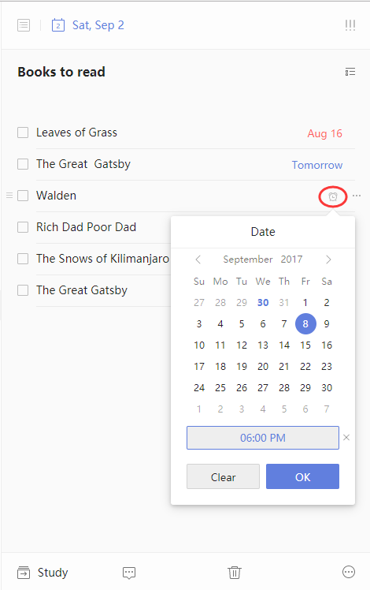

### How to create reminder for subtask?

To create separate reminder for each subtask is an additional feature that available to TickTick Premium users only.

1. Open TickTick and select a task that contains subtasks
2. Move your cursor hovers over a subtask
3. Click the "alarm" icon and create a reminder for this individual subtask
4. Select another subtask and repeat step 3 to create another reminder

