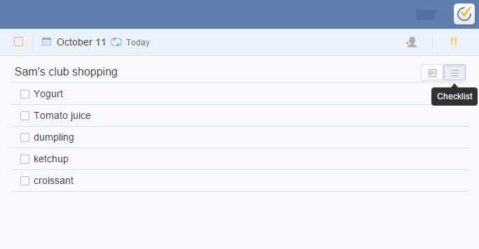

## How to create a checklist?
Enter task title in "quick add bar" first and then click the "checklist" icon to create a checklist. Checklist is always used to add subtasks such as shopping list: break big tasks into small ones such as family trip arrangement or create tasks invoving multile steps.

