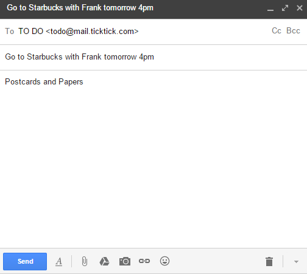

###How to add a new task via email?
1.Click the avatar on top right corner to enter “Settings” > “Mail Service”.

2.There is a designated email address. Email a task to that address and it will be converted as a to-do item in your TickTick account automatically. Or, you can email your tasks to **<mark>todo@mail.ticktick.com</mark>**with your TickTick registered email address directly.

The subject of the email will be the title of the task while the content of the email will be the task details. Beside, you can add date and reminder time on the email subject. For example, you can write “Go to Starbucks with Frank tomorrow 4pm” or “Go shopping 2/4 4pm” in the subject, then you will find this task in TickTick’s “Inbox” with due date (tomorrow or Feb 4) and reminder time (4 pm).

