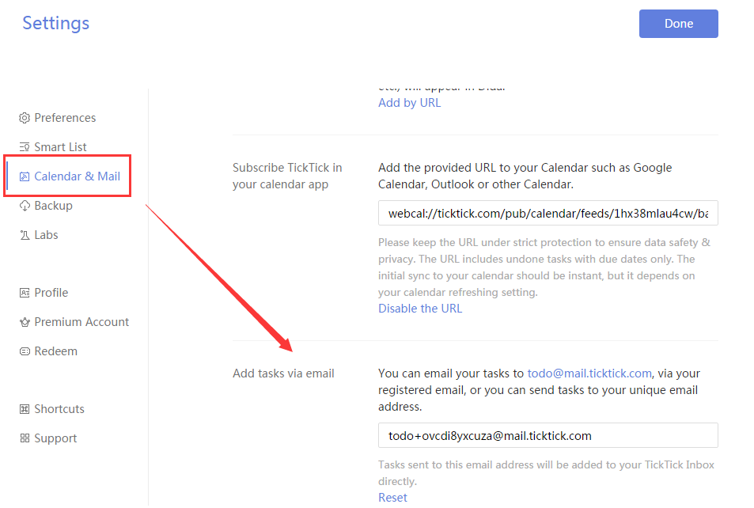

###How to add a new task via email?

If your email inbox is full of to-dos, you can turn them into tasks using Mail Service in TickTick.

1.Sign in TickTick on web.

2.Click your avatar in the upper-left hand corner of the page.

3.Select “Settings”, and click “Calendar & Mail”.

There are two email address in the section of “Add tasks via email”:

**<mark>todo@mail.ticktick.com</mark>**: If you sign in TickTick with an email, you can email your task to todo@mail.ticktick.com via your regitered email.

**<mark>todo+####@mail.ticktick.com<mark>**: It is generated for your TickTick account. So you can email your task to todo####@mail.ticktick.com via any email.

The subject of the email will become as the title of the task, while the content of the email will become as task details. Besides, you can add date and reminder time to the email subject. For example, you can write “Go to Starbucks with Frank tomorrow 4pm” or “Go shopping 2/4 4pm” in the subject, then you will find this task in TickTick’s “Inbox” with due date (tomorrow or Feb 4) and reminder time (4 pm).

