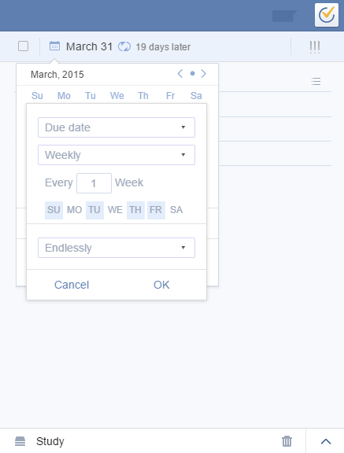

###How to add a recurring task?
1.Click the due date in the right panel.

2.Click the “No Repeat” bar. You can choose such as Daily/Weekly/Monthly/Yearly/ or click “Advanced” to customize the repeating interval and repeating type (repeat from completion date or repeat from due date).

 
**Advanced repeating mode**

|repeating interval | mode |
| -- | -- |
|Daily | Every Day |
| Weekly | Repeat every N Weeks Repeat from **Due date/Completion date** Repeat on S/M/T/W/T/F/S|
| Monthly |  Repeat every N Months Repeat from **Due date/Completion date** Repeat by **day of the month/day of the week**|
| Yearly | Repeat by the **day of the year** |

