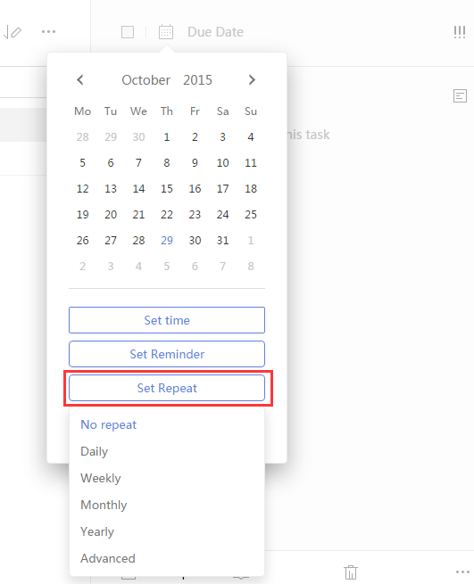

###How to add a recurring task?
1. Sign in to TickTick on the web.

2. Click its due date in the upper-left corner of the right panel. 

3. Click the “Set Repeat” button.

4. Then you can choose a repeating mode such as Daily/Weekly/Monthly/Yearly. Or you can choose “Advanced” to set repeating interval and repeating type.

 
**Advanced repeating mode**

|Repeating Interval | Mode |
| -- | -- |
|Daily | Every Day |
| Weekly | Repeat every N Weeks Repeat from **Due date/Completion date** Repeat on S/M/T/W/T/F/S|
| Monthly |  Repeat every N Months Repeat from **Due date/Completion date** Repeat by **day of the month/day of the week**|
| Yearly | Repeat by the **day of the year** |

